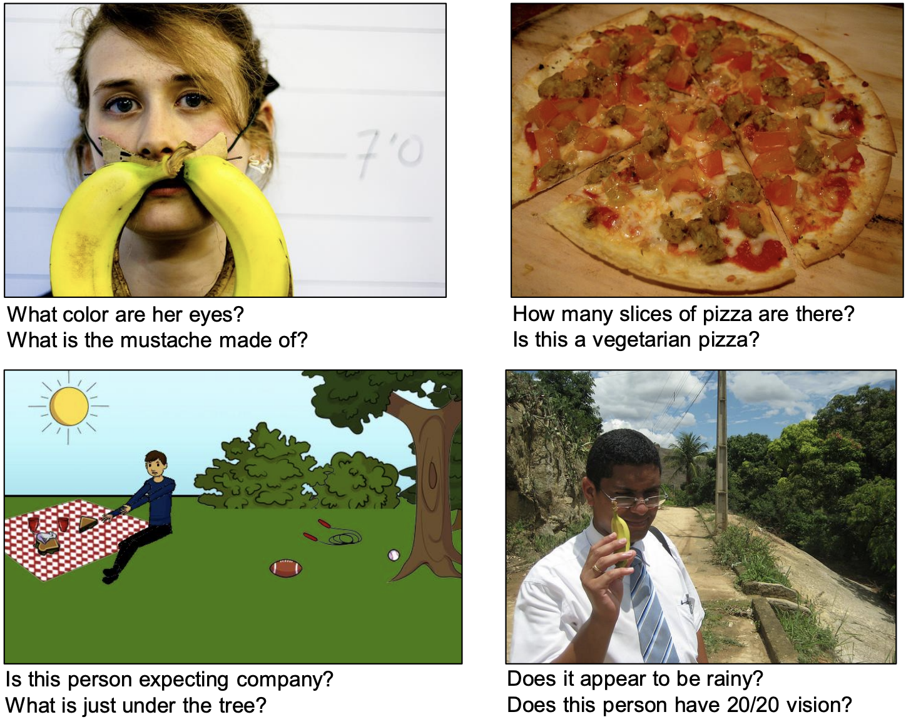

# Visual Question Answering using CLIP

### [Gunjan Aggarwal](https://gunagg.github.io/), [Harsh Maheshwari](https://harshm121.github.io/), [Ashwin Pathak](https://ashwinpathak20.github.io/), [Ram Ramrakhya](https://ram81.github.io/)

*lexicographical ordering

## Introduction

One of the tasks humans efficiently do is make sense of the visual information around us. However, we communicate our understanding of the visual information using natural language. Vision and Language usually go hand-in-hand for a lot of tasks we perform daily and thus it is important for machines to be able to do so as well. Visual Question Answering, introduced in [1], is one such task where the problem is to select one of many possible answers given an image and a question associated with the image. See figure 1 for an example. The VQA v2 [2] dataset has 82,783 training images which lead to 443,757 questions in total. Each question was answered by 10 humans generating a total of 4,437,570 answers.  There has been a lot of interest in multi-modal research, especially on vision and language modalities recently. CLIP [3] accelerated this research by releasing a large self-supervised trained model on a huge corpus of image, text pairs. Thanks to the easy access to the trained model, it has been used for various vision and language tasks such as zero-shot image classification [3], zero-shot text-to-image generation [4] and many others [5, 6]. We propose to leverage CLIP pre-trained embedding space to solve the VQA task.

 Figure 1: Examples of the image, question pairs from the VQA dataset 

## Problem definition

 Giving machines the ability to understand and communicate the understanding through question answering is an important and impactful task with a lot of social benefits like helping visually impaired humans [7]. However, it is often difficult and expensive to train huge models on large datasets. We propose to leverage the already available pre-trained vision-and-language CLIP model for the VQA task efficiently. 

## Methods

**Supervised section**: CLIP has a visual encoder and a text encoder trained to align the vision and text embeddings when the inputs are aligned. We plan on adding a question-answer encoder that transforms the text embeddings from the question and the correct answer to align well with the image embedding. 

**Unsupervised section**: While inference, the above approach would require encoding all possible answers to select the one which aligns the most. However, this is inefficient as the answers can be filtered out based on the question type. For example, the answer to “What color is …?” can never be “apple”. Thus if we are able to form clusters of answer types, we can use these clusters to filter out potential answers and reduce the computation cost while inference. 

## Potential results and Discussion

Our focus in this report is going to be on training efficient (zero-shot, few-shot or less parameter model) rather than on getting high performance on the VQA task. However, we expect to get *reasonable* performance which should be possible if we leverage the nicely trained vision-and-language embedding space effectively. 

### References

[1] S. Antol *et al.*, “Vqa: Visual question answering,” in *Proceedings of the IEEE international conference on computer vision*, 2015, pp. 2425–2433.

[2] Y Goyal, Tejas Khot, Douglas Summers-Stay, Dhruv Batra, and Devi Parikh. Making the V in VQA matter: Elevating the role of image understanding in Visual Question Answering. In Conference on Computer Vision and Pattern Recognition (CVPR), 2017.

[3] A. Radford *et al.*, *Learning Transferable Visual Models From Natural Language Supervision*. 2021.

[4] O. Patashnik, Z. Wu, E. Shechtman, D. Cohen-Or, and D. Lischinski, “StyleCLIP: Text-Driven Manipulation of StyleGAN Imagery,” in *Proceedings of the IEEE/CVF International Conference on Computer Vision (ICCV)*, Oct. 2021, pp. 2085–2094.

[5] H. Xu, K. He, B. A. Plummer, L. Sigal, S. Sclaroff, and K. Saenko, “Multilevel language and vision integration for text-to-clip retrieval,” in *Proceedings of the AAAI Conference on Artificial Intelligence*, 2019, vol. 33, no. 1, pp. 9062–9069.

[6] M. Narasimhan, A. Rohrbach, and T. Darrell, “CLIP-It! language-guided video summarization,” *Advances in Neural Information Processing Systems  (NeurIPS), vol. 34, 2021.

[7] D. Gurari *et al.*, “Vizwiz grand challenge: Answering visual questions from blind people,” in *Proceedings of the IEEE Conference on Computer Vision and Pattern Recognition* (CVPR), 2018, pp. 3608–3617.

## Proposed timeline and responsibilities

